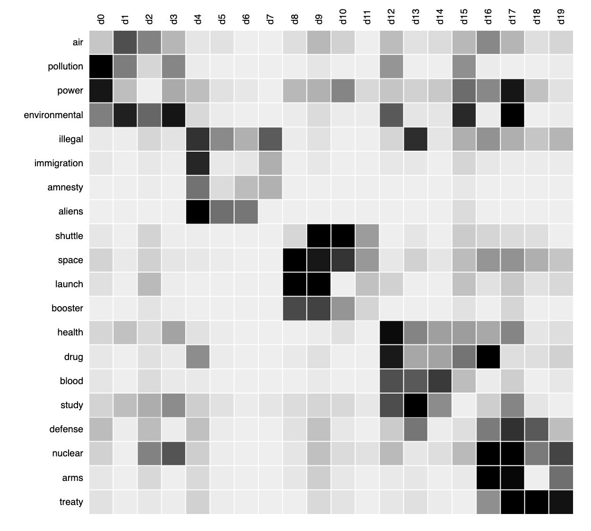
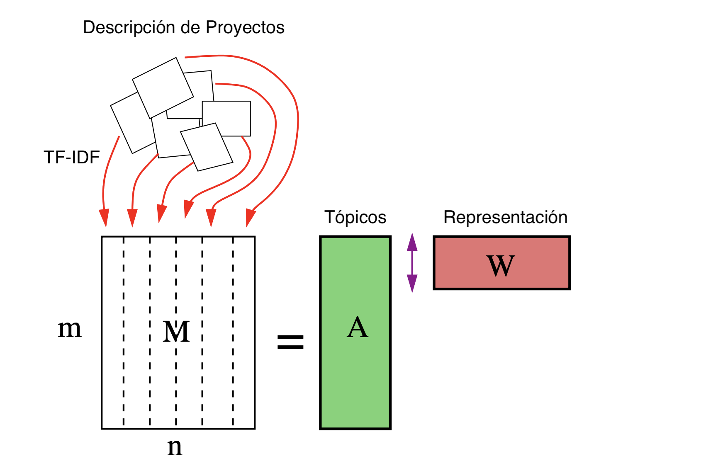
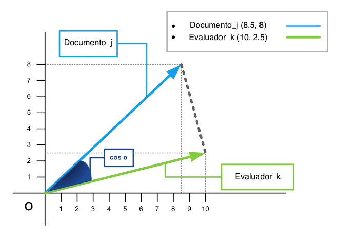

## Sistema Recomendador de clases a parír de textos

Este proyecto tiene como objetivo automatizar el proceso de búsqueda de las
clases óptimas con un conjunto de textos de acuerdo a la similitud de sus textos.

Este proyecto puede aplicarse a textos donde se necesita sugerir una o varias
clases, entiéndase clase como  individuos, personas, temas o textos. Por ejemplo,
si **se quiere encontrar al autor o un evaluador especializado más afín a un conjunto de textos**.

Se hace uso de herramientas de procesamiento de lenguaje Natural ([NLP](https://en.wikipedia.org/wiki/Natural_language_processing))  para comparar el contenido
semántico del texto de la descripción del texto a encontrar sugerencia con la
descripción los textos de las clases.

Se sugieren las 10 clases que contengan los textos más similares al del texto a
recomendar.

#### -- Project Status: [On-Hold]
***

### **1. Limpieza de textos y Steamming (obtención de raíces)**

###### Limpieza:
- Convierte caracteres de utf8 a ascii y elimina errores.
- Elimina filas con entradas vacías.
- Se deshace de palabras con un número de carácteres menor a 3.

###### Steamming:

- Obtiene las raíces de las palabreas de la descripción de cada
texto.

Por razones gramaticales, las descripciones utilizarán diferentes formas de una palabra, como organizar, organización y organiza. Además, hay familias de palabras derivadas relacionadas con significados similares, como democracia, democratización y democrático. En muchas situaciones, es útil para una búsqueda de una de estas palabras devolver documentos que contienen otra palabra en el conjunto. [1]

El objetivo de la derivación y la lematización es reducir las formas de inflexión y a veces, las formas derivadas de una palabra a una forma de base común. Por ejemplo:

    computadora, computación, cómputo ➡ comput

El resultado de este proceso será el algo muy parecido a lo siguiente:

    los autos del niño son de diferente color ➡ auto niñ diferen color

Con este proceso nos acercamos a obtener únicamente el contenido semántico
del texto y nos deshacemos de inflexiones o palabras que no nos
aportan información acerca del área de estudio de la descripción del texto.

### **2. Vectorización TF-IDF**

- Genera un vectorizador de textos usando tf-idf.
- Obtiene los vectores de importancia de palabra cada texto.

Tf-idf significa *Term Frequency - Inverse Term Frequency*, tf-idf es utilizado en la recuperación de información y minería de texto. TF-idf es una medida estadística utilizada para evaluar la importancia de una palabra para un documento en una colección
de textos o corpus.[2]

En un corpus de texto grande, algunas palabras están muy presentes
(por ejemplo, "el", "a", "y"), por lo tanto, llevarán muy poca información sobre el contenido real del
documento. Si tuviéramos que alimentar los datos de conteo directamente a un
clasificador, esos términos muy frecuentes tendrían mucho peso comparado
con el peso de términos más raros pero más interesantes.[3]

Usando la configuración predeterminada de [TfidfTransformer](https://scikit-learn.org/stable/modules/generated/sklearn.feature_extraction.text.TfidfTransformer.html?highlight=tf%20idf#sklearn.feature_extraction.text.TfidfTransformer) de la libreriía Sci-Kit:

    TfidfTransformer(norm = 'l2', use_idf = True,
                     smooth_idf = True, sublinear_tf = False)

La frecuencia del término es decir, el número de veces que se produce un
término en un documento determinado, se multiplica con el componente idf, que
es calculado como:

>

##### Ejemplo

    Considere un documento que contiene 100 palabras en el que la palabra gato
    aparece 3 veces. El término frecuencia (es decir, tf) para gato es
    (3/100) = 0.03. Ahora, supongamos que tenemos 10 millones de documentos y
    la palabra gato aparece en mil de estos. La frecuencia inversa del
    documento (es decir, idf) se calcula como log(10,000,001 / 1,000+1) = 4.
    Por lo tanto, el peso Tf-idf es el producto de estas cantidades:
    0.03 * 4 = 0.12.

A continuación se muestra la matríz TF-IDF de un conjunto de documentos de
diferentes temas tales como "air", "pollution", etc. con un conjunto de palabras
etiquetadas como d0, d1, dn:

>
   Matríz de words-documents, cada columna corresponde a un documento, cada fila a una palabra. Una celda almacena la frecuencia de una palabra en un documento, las celdas oscuras indican altas frecuencias de palabras. La clusterización por topic Modelling agrupan los
   documentos, que usan palabras similares, así como las palabras que aparecen
   en un conjunto similar de documentos. Los patrones resultantes se
   denominan "temas" o "tópicos".

  Obtenido de: [http://www.issac-conference.org/2015/Slides/Moitra.pdf](http://www.issac-conference.org/2015/Slides/Moitra.pdf)

###  **3. Matríz de Pertenencia NMF**

- Genera una matríz de tópicos a través de el vector de importancia de palabras
del paso anterior.

NMF (Non-Neggative Matrix Factorization) encuentra una descomposición dos matrices y de elementos no
negativos, optimizando la distancia entre el producto y la matriz. La función
de distancia más utilizada es la norma de Frobenius al cuadrado: [4]

##### NMF y Topic Modelling

Se desea descomponer la matriz matriz de palabras-documentos obtenida con TF-IDF , donde cada columna representa un documento, y cada elemento en las filas representa el peso de una palabra determinada.

> ¿Qué sucede cuando descomponemos la matríz TF-IDF en dos matrices?

Si la descripción de un conjunto de textos es de física estadística. Es probable que la palabra "distribución" aparezca en los artículos relacionados con los el tema  y, por lo tanto, coincida con palabras como "modelo" y "macroscópico". Por lo tanto, estas palabras probablemente se agruparían en un vector componente de "física estadística", y cada artículo tendría un cierto peso del tema.

>
   Esquema de la descomposición de la matríz TF-IDF usando NMF. Obtenido de: [http://www.issac-conference.org/2015/Slides/Moitra.pdf](http://www.issac-conference.org/2015/Slides/Moitra.pdf)

Por lo tanto, una descomposición NMF de la matriz de términos y documentos generaría componentes que podrían considerarse "temas" o topicos, y descompondría cada documento en una suma ponderada de temas. Esto se llama **topic modelling** y es una aplicación importante de NMF.

###  **4. Generación del Vector de Tópicos por Clase**
- Genera un vector de pertenencia de tópicos para cada clase. El numero de
dimensiones lo indica el grid search.

###  **5. Evaluación del Modelo**

La métrica de evaluación se seleccionó con el objetivo de
generar un modelo que recomiende, para un mismo texto,
las mismos clases que evaluaron el texto.
Por este motivo se eligio tomar como metrica el número de coincidencias entrenamiento el conjunto de clases reales *i.e.* los elegidos
y las clases recomendados por el modelo:

 

Donde  es el número de documentos totales y  son los vectores de cada documentos
de topicos de las clases sugeridos y reales respectivamente. Bajo esta
métrica, cuando todos las clases recomendadas son iguales a los clases
reales, el resultado es 1.0 y cuando no coincide ningun elemento de los dos
conjuntos es 0.0.

###  **6. Recomendación de clases**

Para seleccionar los clases de un texto, se procede comparando el vector de tópicos del texto con los vectores de tópicos de todas las clases.

>
   Esquema de la comparación del vector de tópicos de un documentos y de un clase .

Se utiliza [cosine similarity](https://www.machinelearningplus.com/nlp/cosine-similarity/) como métrica de similitud:

 

Se toman las N clases que tengan mayor similitud con el vector del texto.

---
## Reproducción del modelo

El código está escrito en Python y consiste en un script '**pipeline_train_test**'
 donde todo el procedimiento se lleva a cabo llamando a funciones de tres módulos: **'CleanTools'** para aplicar una limpieza y steamming a los textos (paso 1), **'AlgoritmosPipeline'** para aplicar el proceso de TF-idf, NMF y la generación
 de vector de tópicos por clase (pasos 2, 3, 4) y **'ScorePipelineCoincidencias '** para obtener el desempeño del modelo usando la métrica descrita en el paso
 5.

 | Proceso                                          | Archivo                     |
|--------------------------------------------------|-----------------------------|
| 1. Limpieza                                      | cleaning_steamming.py       |
| 2. Vectorización TF-IDF                          | algoritmos_entrenamiento.py |
| 3. Matríz de Pertenencia NMF                     | algoritmos_entrenamiento.py |
| 4. Generación de vector de Tópicos por clase | algoritmos_entrenamiento.py |
| 5. Evaluación del Modelo                         | score.py                    |

#####  Archivos de entrenamiento y modelos entrenados:
Archivos de entrenamiento:
- [Muestra de 5 textos por clase](https://pub.ccd.conacyt.mx/s/Sr4R8BPinwWEaL2)
- [Muestra de 10 textos por clase](https://pub.ccd.conacyt.mx/s/Sr4R8BPinwWEaL2)

Modelos Entrenados:

- [Vectorizador TF-IDF]()
- [Matriz NMF]()

Vector de tópicos por clase:
- [Tópicos por clase]()

#####  Dependencias

Los siguientes módulos son necesarios para ejecutar el código:

- joblib==0.14.0
- nltk==3.4.5
- numpy==1.17.4
- pandas==0.25.3
- python-dateutil==2.8.1
- pytz==2019.3
- scikit-learn==0.21.3
- scipy==1.3.3
- six==1.13.0
- sklearn==0.0

Estos módulos pueden encontrarse en '**requirements.txt**'.

### 0. Ingesta de Datos.

La ingesta de las tablas de entrenamiento necesita los siguientes campos:

      Datos no publicos...

### 1.  Entrenamiento del modelo
- Solo necesario si se desea volver a entrenar el modelo.

La búsqueda de parámetros se encuentra en el
archivo **'grid_search'**. Se tomó una muestra de 10,00 textos  debido a que el tiempo del proceso de cada iteración es es de 6 horas con esta muestra.

1. Verificar que todas las dependencias estén instaladas.
2.  Verificar que el archivo de entrenamiento  **'datos_training_n_eval_5_sample.pkl'** se encuentre en la ruta '**./data/entrenamiento/**'.

3. Ejecute el archivo '**grid_search**' para hacer la búsqueda de parámetros que maximicen el score del modelo. En el notebook **./notebooks/cosine_simmilarity/cosine_similarity_coincidencias.ipynb'**,
se encuentra un análisis de los resultados.

4. Introduzca los parámetros seleccionados y ejecute el archivo
'**entrenamiento**' para entrenar el modelo con el todos los datos y
guardar el vectorizador, la matriz NMF y el vector de tópicos por clase.

**Notas:**

- Valores altos del número de componentes pueden provocar overfitting.[5]

- El tiempo de ejecución es de alrededor de 8 horas.

##### Generación de Vectores de Tópicos de los textos a evaluar

Se obtiene el vector de tópicos de cada texto. Una vez que el modelo está entrenado, es posible obtener el vector de tópicos para nuevos textos.

1. Es necesario que el formato de la tabla siga lo descrito en la sección de ingesta de datos, omitiendo
el campo CVU del clase ya que este es el que se asignará.

1. Verificar que las tablas de los textos a obtener el
vector de tópicos se encuentre en '**"./data/entrenamiento/**'.

2. Ejecute el archivo '**propuesta_clases**' para obtener los N clases sugeridos por el modelo.

La tabla final se encuentra en **./trained_modelos/resultados/propuesta_clases.csv'** los resultados obtenidos contienen el id del texto, el CVU del clase y el score del cosine similarity obtenido entre ele vector del texto y el vector del clase:

| id_texto | CVU | score_tm |
|-------------|-------|--------------------|
| 104412 | 43 | 0.557|
| 104412 | 432 | 0.542 |
| 104412 | 242 | 0.507|
| 104412 | 654 | 0.504|
| 104412 | 456 | 0.502|
| 847634 | 345 | 0.525|

---
### Referencias

[1] [https://nlp.stanford.edu/IR-book/html/htmledition/stemming-and-lemmatization-1.html](https://nlp.stanford.edu/IR-book/html/htmledition/stemming-and-lemmatization-1.html), visitado el 12/12/2019.

[2] [http://www.tfidf.com](http://www.tfidf.com), visitado el 12/12/2019.

[3] [https://scikit-learn.org/stable/modules/feature_extraction.html?highlight=tfid](https://scikit-learn.org/stable/modules/feature_extraction.html?highlight=tfidf), visitado el 12/12/2019.

[4] [https://mlexplained.com/2017/12/28/a-practical-introduction-to-nmf-nonnegative-matrix-factorization/](https://mlexplained.com/2017/12/28/a-practical-introduction-to-nmf-nonnegative-matrix-factorization/) , visitado el 11/12/2019.

[5] Blair, S.J., Bi, Y. & Mulvenna, M.D. Appl Intell (2019). https://doi.org/10.1007/s10489-019-01438-z
